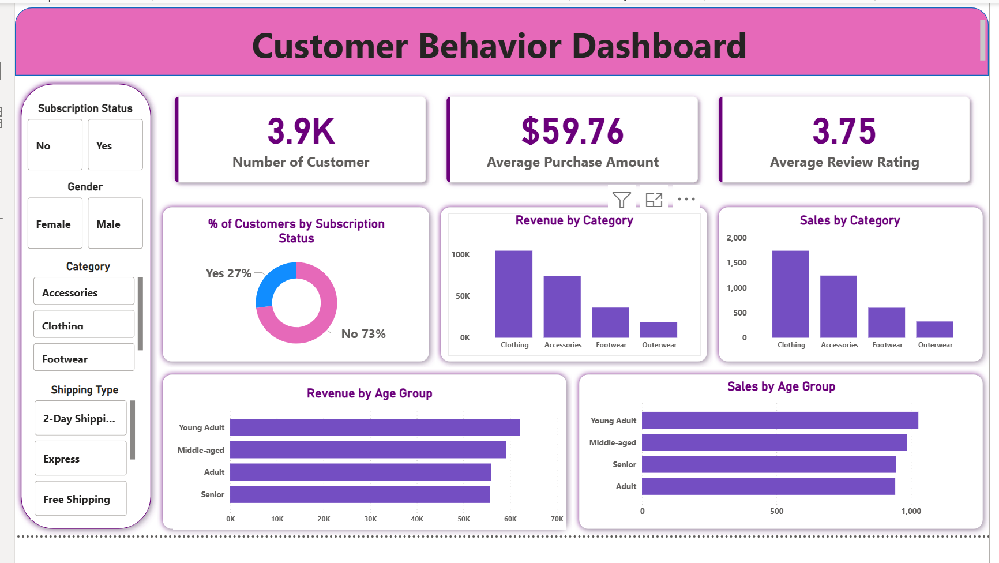

## 📌 Project Overview

This project analyzes customer behavior using SQL and Power BI to uncover insights related to customer spending, preferences, and trends.

The dashboard helps businesses make data-driven decisions by understanding customer segments, product performance, and revenue patterns.

---

## 🛠️ Tools & Technologies Used

* SQL – Data extraction and transformation
* Power BI – Data visualization and dashboard creation

---

## 📂 Dataset Details

The dataset includes:

* Customer ID
* Gender
* Age Group
* Product Category
* Purchase Amount
* Subscription Status
* Shipping Type
* Review Rating

---

## 📊 Dashboard Features

* 📌 Total Customers Overview (3.9K)
* 💰 Average Purchase Amount ($59.76)
* ⭐ Average Customer Rating (3.75)
* 📊 Revenue by Category
* 📦 Sales by Category
* 👥 Customer Distribution by Subscription
* 🎯 Sales & Revenue by Age Group
* 🎛️ Interactive Filters:

  * Gender
  * Category
  * Shipping Type
  * Subscription Status

---

## 📸 Dashboard Preview



---

## 📈 Key Insights

* Clothing category generates the highest revenue
* Most customers are non-subscribers (73%)
* Young adults contribute the highest revenue
* Average customer rating is moderate (3.75)
* Accessories and clothing dominate sales

---

## 🚀 How to Use This Project

1. Download the repository
2. Open `SQL_Queries.sql` and run queries
3. Load dataset into Power BI
4. Open `Customer_Behavior.pbix`
5. Interact with dashboard

---

## 📁 Project Structure

```
customer-behavior-analysis
 ┣ 📊 Customer_Behavior.pbix
 ┣ 🗄️ SQL_Queries.sql
 ┣ 📁 dataset
 ┣ 📁 screenshots
 ┗ 📄 README.md
```

---


---

## 👨‍💻 Author

Aishwarya Pithe

---

⭐ If you like this project, give it a star on GitHub!

